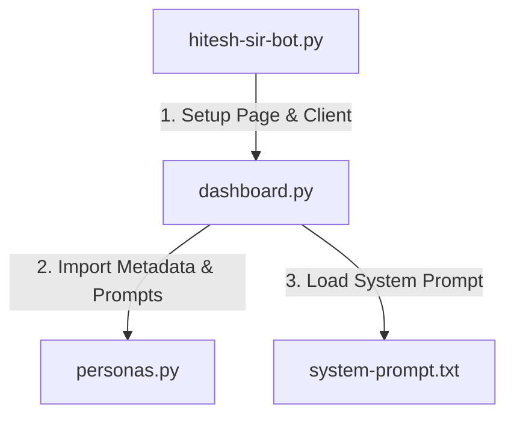

# Multi-Persona Learning Portal 

An interactive, multi-persona Streamlit web application tailored to provide educational tutorials, medical advice, legal insights, and startup strategy using custom domain-specific analogies and dynamic context-aware prompts. 

## 📋 Problem Statement
The goal is to make a modern, robust, and responsive Web Dashboard that:
1. Supports **multiple professional advisors** (Hitesh Sir, Dr. Vijay, Ramesh, and Maninder), each explaining concepts strictly in their own field of expertise (Coding, ENT Health, Law, and Business Strategy) rather than everyone explaining coding.
2. Automatically redirects coding/programming questions back to Hitesh Sir if the user asks them to the Doctor, Lawyer, or Businessman.
3. Gathers user profile contexts (prior experience, target interest topic, and learning style) via a card-based questionnaire before beginning the chat.
4. Employs a premium, high-contrast dark-mode theme matching the "Chai aur Code" aesthetic, with real-time response streaming.

---

## 🛠️ Solution & Architecture
To maintain clean codebase standards, the application is divided into a **modular three-file architecture**:



### 1. `hitesh-sir-bot.py` (Entry Point)
* Acts as a lightweight bootstrapper.
* Automatically detects if run as a standard Python script and launches it in Streamlit.
* Handles page metadata configuration, loads environment variables silently from `.env`, initializes the `google.genai.Client`, and invokes the dashboard module.

### 2. `dashboard.py` (Streamlit UI & Logic)
* Contains the styling overrides, questionnaire forms, and chat messaging logic.
* Handles Streamlit session state management, keeping track of form progress and message histories.
* Connects to the Gemini API using `client.models.generate_content_stream` to display typed streaming responses word-by-word.

### 3. `personas.py` (Configuration & Prompts)
* Stores the details of each advisor (avatar emoji, theme colors, domain classifications, input placeholders, and system instructions).
* Dictates system-prompt boundaries to ensure Dr. Vijay, Ramesh, and Maninder remain focused on their core subjects (Medicine, Law, and Business) and redirect coding queries to Hitesh.

---

## 💡 Key Design Decisions & Technical Highlights

### 1. Isolated Virtual Environment (`.venv`)
* Set up a virtual environment to isolate the project's dependencies (`streamlit`, `google-genai`, `python-dotenv`, `websockets`, etc.) from the global environment.
* Created a `.gitignore` to prevent committing `.venv` binary outputs and Python compilation files (`__pycache__`) to version control.

### 2. Streamlit Container Structure for Drag Events (The Slider Fix)
* **The Issue**: Split HTML tags (e.g. `<div>` opened in one widget and closed in another) generate malformed React DOM structures. This breaks browser pointer events, causing drag gestures on widgets like `st.select_slider` to freeze.
* **The Fix**: Replaced split HTML wrappers with native Streamlit containers:
  ```python
  with st.container(border=True):
      p_level = st.select_slider(...)
  ```
  Applied the dark glassmorphism card style to the container's layout ID (`div[data-testid="stVerticalBlockBorderContainer"]`) in CSS. This retains the premium look while keeping event listeners fully interactive.

### 3. State Preservation Across Reruns
* Added explicit state-saving keys (`key="user_level"`, `key="user_interest"`, `key="user_preference"`) to the questionnaire inputs. This ensures Streamlit remembers typed text even if the user clicks between different teacher cards.

### 4. Alternating Chat Turn Alignment
* Streamlit chats show initial advisor greetings. However, sending a history starting with a model turn causes a `400 Bad Request` validation error from the Gemini API. 
* We filtered out the initial greeting turn from the payload contents before API submission so the history always starts with a `"user"` turn and alternates cleanly.

---

## 🚀 How to Run the Project

### Prerequisites
* Python 3.10 or higher.
* A Gemini API key 

### Run Command
Simply execute the entry point script:
```powershell
.\.venv\Scripts\python hitesh-sir-bot.py
```
This will automatically launch the Streamlit server and open your default browser at **http://localhost:8501**.
